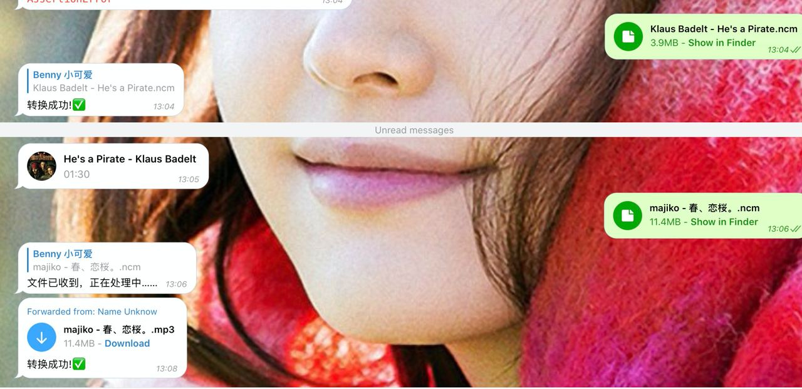

# NCMBot

🐿️ 能够帮你把网易云音乐ncm格式转换为flac的Telegram Bot

[🐿️ NCMBot](https://t.me/netease_ncm_bot)

# 使用方法

直接发送文件给bot即可，支持大文件，最大可支持2G

# 截图



# 部署

需要去 [Telegram API](my.telegram.org) 申请自己的ID和hash。

## 普通方式

```shell script
git clone https://github.com/tgbot-collection/NCMBot
cd NCMBot
pip3 install -r requirements.txt
# 配置环境变量 APP_ID APP_HASH TOKEN
export APP_ID=1111 APP_HASH=dddd TOKEN=xxx
python ncmbot.py
```

## docker

```shell script
docker run -d -e APP_ID=1234 -e APP_HASH=1234 -e TOKEN=1NFXI bennythink/ncmbot
```

# Commands

```
start - 开始使用机器人
about - 关于机器人
ping - 运行信息
```

# License

Apache License 2.0